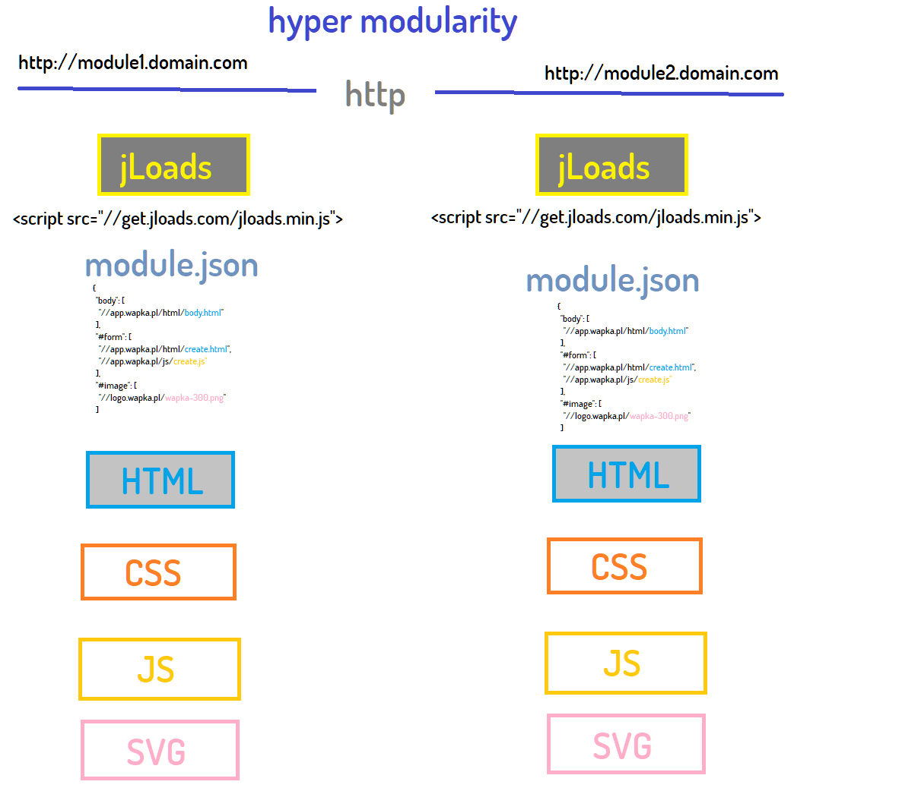

# Modularyzacja oprogramowania

+ [modularyzacja www](https://www.modularyzacja.pl/)

+ [modularyzacja blog](https://blog.modularyzacja.pl/)

    

## Wstęp
https://modularyzacja.github.io/www/

[index](https://modularyzacja.github.io/www/index.html)

    Modularisation -> Standardisation -> Specialisation -> Automation -> Continuous Improvement

Modularyzacja znajduje się na samym początku z powodu jej abstrakcyjnej funkcji, która każe dzielić w celu ustandaryzowania i wyspecjalizowania danych.

Powyższe procesy należą do łańcucha wytwarzania i doskonalenia oprogramowania.

## Dlaczego?

Dlaczego stworzyłem narzędzie (biliotekę) do prototypowania jLoads?

    jLoads to javascript router and loader.

Idea nie jest nowa, ale implementacja interesująca, na tyle, że jest udostępniona wszystkim w internecie, moim zdaniem to sensowy pomysł do zastosowania globalnie, dla każdego, kto umie tworzyć strony www na poziomie szkoły podstawowej.

+ Błyskawiczne i zwinne dostarczanie rezultatów.

# Modularyzacja

Modularyzacja w programowaniu to dość rzadkie zjawisko, z reguły delegowana jest ona środowisku, framework'owi, bibliotekom.

Jednak można inaczej ...

## Zastosowanie

Modularyzacja pozwala na oszczędności, zwłaszcza w binzesach, gdzie kluczowe jest prototypowanie.

Również Startup-y potrzebują szybko dostarczać widoczne rezultaty dla klientów i inwestorów, bez wchodzenia w detale.

Gdy trudno przewidzieć kierunek rozwoju usługi, warto korzystać z natywnych technologii, które są
znane *każdemu programiście, gdyż wchodzenie w specjalizację na początku może skończyć się po odejściu jednego z pracowników, albo kosztować więcej przy kolejnej iteracji.

Gra toczy się nie tyle o rezultat co o zwinność w dostarczaniu rezultatów.
Rozwiązanie, które obecnie działa w oparciu o modularyzację dla aplikacji pisanych w #javascript to #jloads

* #javascript #php #python #bash

# modularyzacja i jloads

tutaj jest dokumentacja https://docs.jloads.com/

to tylko jeden z etapów modularyzacji. 

W praktyce wygląda to tak, że stworzysz sobie domenę/subdomenę na której masz treść w formatach używanych na front-endzie (JS/html/css/svg/json)

Każdy kto będzie chciał wykorzystać Twoją treść, np gotowy formularz, czy aplikację doda tylko adres Twojej strony bądź konkretne adresy domen modułów z których się składa.

Pozwala na tworzenie modularnej strony na podstawie zawartości innych stron, bez użycia iframe, itd.

jLoads ładuje po podaniu adresu to do odpowiedniego miejsca na stronie WWW.

## Standardy

Wszystkie standardy istnieją, dlatego z dnia na dzień można zrobić ewolucję poprzez modularyzację, temat nie jest nowy, ale zmierzyłem się z nim i nie wiem co dalej z tym zrobić, aby nie stracić już włożonego wysiłku.

To o czym piszę, pozwala na oszczędności czasu wynikającą z prototypowania na podstawie gotowych klocków i do tego bez marketplace!!! każdy już teraz może partycypować w tym

## Jak to działa?

nic co wychodzi poza to co jest, to kwestia sposobu użycia a nie tworzenia nowej technologii. Biblioteka jLoads tylko pomaga skupić się na ładowaniu i routowaniu content-u w odpowiednie miejsce na stronie www. HTTP + JS, nic ponadto.

Tradycyjnie ładujemy elementy strony poprzez tagi: script, link, itd. Tutaj tylko definiujemy plik JSON, który jest definicją Twojej strony i który jednocześnie jest jej mapą, służąc innym użytkownikom internetu, którzy moga korzystać z tego co Ty już zbudowałeś (kwestia użycia licencji).

## Co jest w tym nowego?

To, że każda strona zamiast zawierać już zrenederoweany kod HTML jest opisana plikiem JSON z minimalną ilością HTML.

W ten sposób skupiamy się na modularyzacji i pozwalamay na re-użycie kodu, napisanego w dodatku przez innych.

+ Nie potrzbujesz do tego marketplace, bo każda strona www znajduje się pod jakąś domeną. 

## Przykład
przykładowo, tutaj są:
+ dwie strony www
+ moduły na subdomenach
 
które mając konfigurację w pliku json.

Mogą łatwo pobrać zawartość modułów użytych do budowy strony poprzez jLoads (+module.json) i zrobić kopię lub dodać pewną funkcjonalność z innej strony

# paczki npmjs

Obecnie aby podzielić się jakimś modułem musisz korzystać np z npmjs, skąd pobierasz paczki JS, ja poszedłem dalej i zamiast budować marketplace do paczek, pozwalam innym bezpośrednio peer to peer używać swojego kodu.

Nie musisz być rasowym programistą by to zrobić, bo idea polega na podaniu url i odbywa się bezpośrednio w przeglądarce.
W głowie mam znacznie wykraczające poza to rozwiązanie po stronie serwera, które będzie zawierało repozytorium z wersjonowaniem danych i kodu, ale na to przyjdzie czas....

# Timing

ilość informacji na temat modularyzacji jest skąpa.

Hashtag #modularization nie jest popularny co oznacza niską świadomość.

W przypadku innowacji to nie ona sama a #TIMINIG decyduje o sukcesie.

Obecnie jest czas, gdy jeszcze frameworki frontendowe świętują triumfy, jednak za kilka lat będą mniej użyteczne, gdyż architektura obecnie jest królową zmian a nie frameworki.

